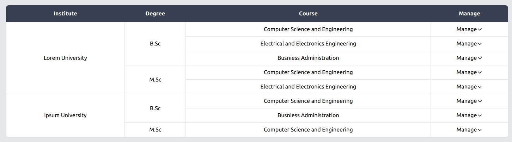

# multi-level-table

> Developed by Ishmum Jawad Khan

[](https://www.npmjs.com/package/multi-level-table) [](https://standardjs.com)

## Install

```bash
npm install --save @dsi/multi-level-table
```

## Usage
### Table data
```js
const data = [
  {
    id: 1,
    name: "Lorem University",
    degrees: [
      {
        id: 1,
        name: "B.Sc",
        courses: [
          {
            id: 1,
            name: "Computer Science and Engineering",
          },
          {
            id: 2,
            name: "Electrical and Electronics Engineering",
          },
          {
            id: 3,
            name: "Busniess Administration",
          },
        ],
      },
      {
        id: 2,
        name: "M.Sc",
        courses: [
          {
            id: 1,
            name: "Computer Science and Engineering",
          },
          {
            id: 2,
            name: "Electrical and Electronics Engineering",
          },
        ],
      },
    ],
  },
  {
    id: 2,
    name: "Ipsum University",
    degrees: [
      {
        id: 1,
        name: "B.Sc",
        courses: [
          {
            id: 1,
            name: "Computer Science and Engineering",
          },
          {
            id: 2,
            name: "Busniess Administration",
          },
        ],
      },
      {
        id: 2,
        name: "M.Sc",
        courses: [
          {
            id: 1,
            name: "Computer Science and Engineering",
          },
        ],
      },
    ],
  },
];
```

### Structure
```js
const structure =
  {
    name: "institutions",
    children: [{
      field: "name",
      display: "Institute"
    }],
    array: {
      name: "degrees",
      children: [{
        field: "name",
        display: "Degree"
      }],
      array: {
        name: "courses",
        children: [{
          field: "name",
          display: "Course"
        }],
      },
    },
  };
```

### Action
```js
const action =
  [
    {
      name: "View Course Details",
      callback: (value) => {
        console.log("Course Details :", value);
      },
    },
    {
      name: "Students",
      callback: (value) => {
        console.log("Students:", value);
      },
    },
  ]
```

### <p id="mlt-custom-css-classnames">Custom CSS classNames</p>
```jsx
const className =  {
  table : 'w-full shadow-sm overflow-hidden rounded-lg text-center',
  head : 'text-white bg-gray-700 text-center',
  body : 'p-2 border-solid border border-light-blue-300'
}
```

### Component
```jsx
import MultiLevelTable from 'multi-level-table'

const ExamplePage = () => {
  return <MultiLevelTable
    data={data}
    structure={structure}
    actions={actions} //optional
    actionLabel="Manage" //optional
    className={className} //optional
  />
}
```

### Output:


### Parameters
| Parameter | Required | Description | Default | Type
| :---: | :---: | :---: | :---: | :---: |
| data | true | fetch data from api or any static data | undefined | ArrayOf(object)
| structure | true | specify the structure of given data | undefined | object
| actions | false | takes array of object {name, callback}. add any actions for nested data | undefined | ArrayOf({ name: string, callback: func})
| actionLabel | false | give action label for actions | Action | string
| className | false | takes a object {table, head, body}. pass CSS classNames to customize table | [see above](#mlt-custom-css-classnames) | {table: string, head: string, body: string}

## License
MIT © [Dynamic Solution Innovators](https://github.com/orgs/DSInnovators/)
